# 🎥 AI Video Analyzer

<div align="center">


[](https://github.com/satya66123/AI-Video-Analyzer/actions/workflows/python-app.yml)


# AI-Powered Video Analysis using Whisper & Multiple LLM Providers

*A modular Python application that converts videos into intelligent insights using speech recognition and Large Language Models.*

</div>

---

# 📑 Table of Contents

- Overview
- Features
- Technology Stack
- Architecture
- Project Structure
- Installation
- Usage
- Workflow
- Screenshots
- Testing
- Documentation
- Future Enhancements
- Contributing
- License
- Author

---

# 📌 Overview

AI Video Analyzer is a modular AI-powered application developed using **Python** and **Streamlit**. The application extracts audio from uploaded videos, generates transcripts using **OpenAI Whisper**, analyzes the transcript using multiple AI providers, and exports detailed reports in multiple formats.

The project demonstrates modern software engineering practices including layered architecture, design patterns, automated testing, continuous integration, and comprehensive documentation.

---

# 🚀 Features

- 🎥 Video Upload & Validation
- 🎵 Audio Extraction using FFmpeg
- 🎤 Speech-to-Text using Whisper
- 🤖 AI-Powered Transcript Analysis
- 📝 AI Summary Generation
- 📌 Key Points Extraction
- ✅ Action Items Generation
- 🧠 Multi-Provider AI Support
- 📄 Export Reports (TXT, HTML, Markdown, PDF)
- 📊 Progress Tracking
- 📜 Transcript Management
- ⚠️ Error Handling
- 📋 Structured Logging
- 🧪 Unit Testing
- 🔄 Continuous Integration

---

# 🛠️ Technology Stack

| Category | Technologies |
|-----------|--------------|
| Language | Python |
| Frontend | Streamlit |
| AI Models | Ollama, OpenAI, Anthropic |
| Speech Recognition | Whisper |
| Multimedia | FFmpeg |
| Testing | Pytest, unittest.mock |
| CI/CD | GitHub Actions |
| Version Control | Git & GitHub |

---

# 🏗️ Architecture

```text
                User
                  │
                  ▼
            Streamlit UI
                  │
                  ▼
          Application Layer
                  │
                  ▼
           Service Layer
 ┌──────────┬──────────┬──────────┐
 │          │          │          │
 ▼          ▼          ▼          ▼
Video    Audio    Speech    AIAnalysis
Service  Service  Service    Service
                  │
                  ▼
           Provider Factory
        ┌────────┼────────┐
        ▼        ▼        ▼
     Ollama   OpenAI  Anthropic
```

---

# 📂 Project Structure

```text
AI-Video-Analyzer/
│
├── app.py
├── requirements.txt
├── requirements_test.txt
├── config/
├── providers/
├── services/
├── utils/
├── components/
├── tests/
├── exports/
├── uploads/
├── transcripts/
├── docs/
└── assets/
```

---

# ⚙️ Installation

## Clone Repository

```bash
git clone https://github.com/satya66123/AI-Video-Analyzer.git

cd AI-Video-Analyzer
```

## Create Virtual Environment

```bash
python -m venv .venv
```

### Windows

```bash
.venv\Scripts\activate
```

### Linux / macOS

```bash
source .venv/bin/activate
```

---

## Install Dependencies

```bash
pip install -r requirements.txt
```

---

## Run Application

```bash
streamlit run app.py
```

---

# 💻 Usage

1. Launch the Streamlit application.
2. Upload a supported video.
3. Video is validated.
4. Audio is extracted using FFmpeg.
5. Whisper generates a transcript.
6. Select an AI Provider.
7. Generate AI analysis.
8. View summary and insights.
9. Export the report.

---

# 🔄 Workflow

```text
Upload Video
      │
      ▼
Video Validation
      │
      ▼
Audio Extraction
      │
      ▼
Whisper Transcription
      │
      ▼
Prompt Builder
      │
      ▼
Provider Factory
      │
      ▼
AI Analysis
      │
      ▼
Summary & Insights
      │
      ▼
Export Reports
```

---

---

# 📸 Application Screenshots

<div align="center">


</div>

These screenshots provide a complete walkthrough of the **AI Video Analyzer** application, demonstrating the workflow from uploading a video to generating AI-powered insights and exporting reports.

---

## 🏠 Home Dashboard

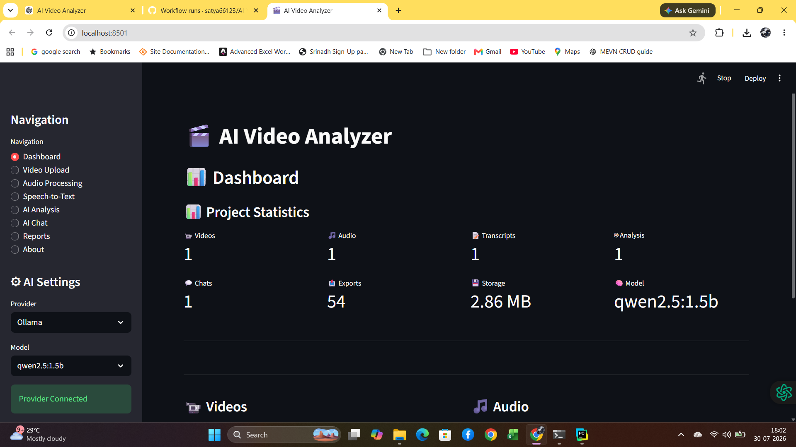

**Highlights**

- Modern Streamlit dashboard
- Navigation sidebar
- Feature overview
- Quick access to all modules

---

## 📤 Video Upload

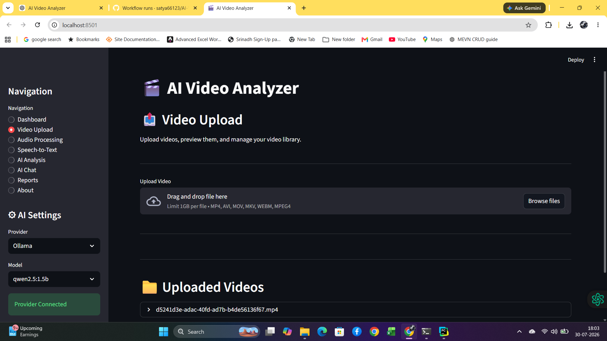

**Highlights**

- Upload MP4, AVI, MOV, MKV, WEBM
- File validation
- Progress indicator

---

## 🎬 Video to Audio

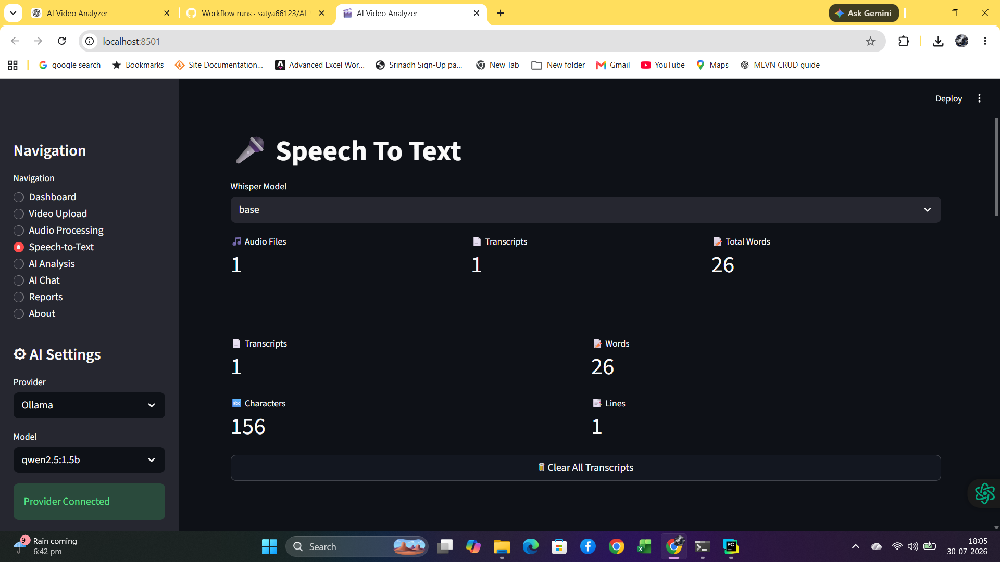

**Highlights**

- FFmpeg integration
- Audio extraction
- Processing pipeline

---

## 🎤 Speech-to-Text

<p align="center">
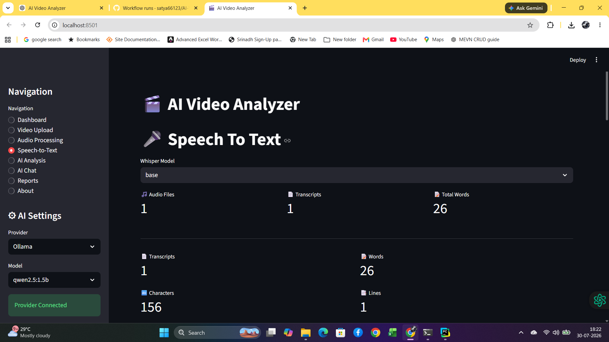
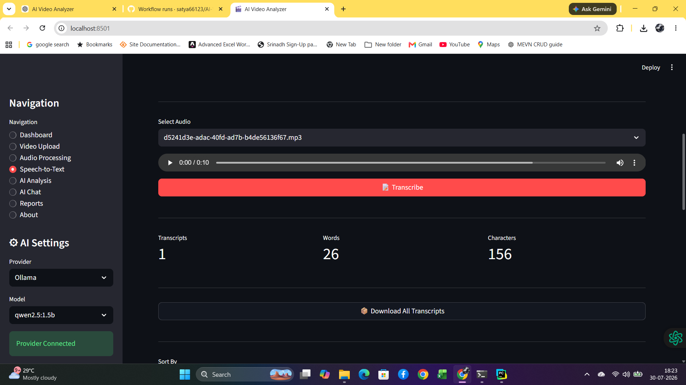
</p>

**Highlights**

- OpenAI Whisper transcription
- Transcript generation
- Language detection

---

## 🔊 Audio Processing

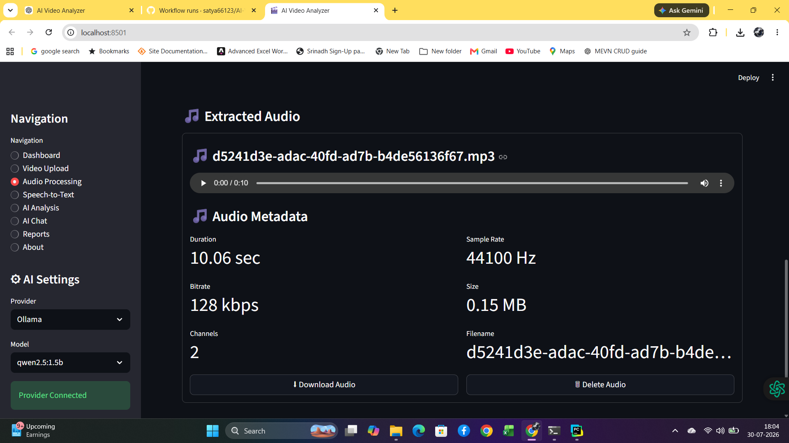

**Highlights**

- Audio preprocessing
- Metadata extraction
- Audio validation

---

## 🤖 AI Analysis

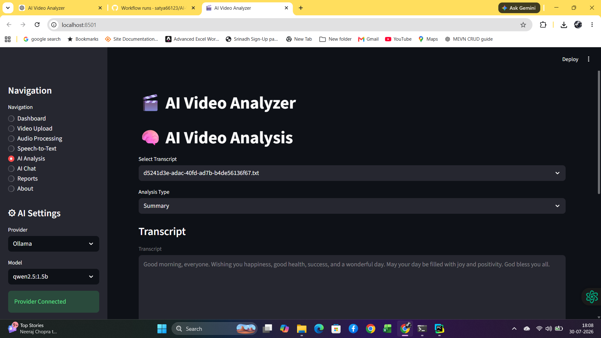
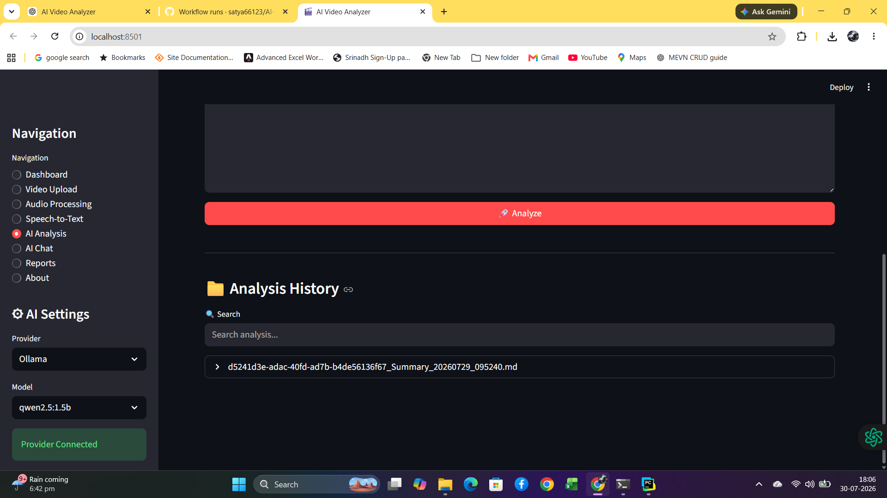


**Highlights**

- AI Summary
- Key Points
- Action Items
- Recommendations
- Multi-Provider AI

---

## 💬 AI Chat

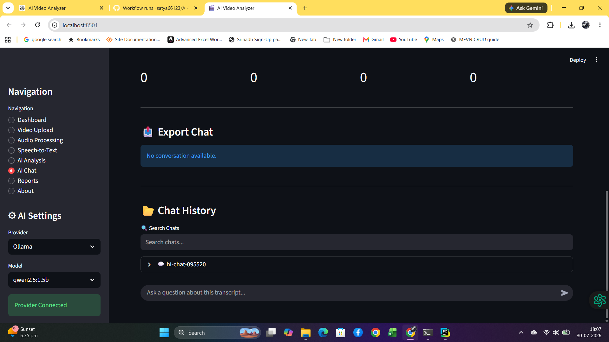

**Highlights**

- Interactive conversation
- Context-aware responses
- Multiple AI providers

---

## 📄 Reports

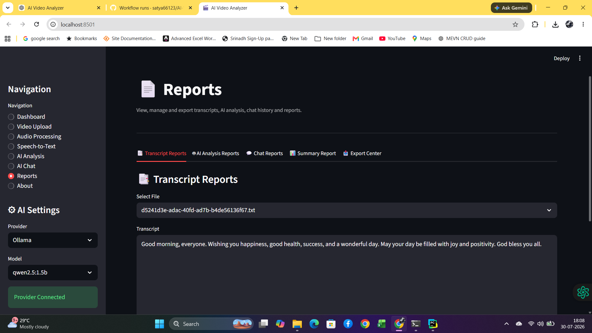

**Highlights**

- Generated reports
- Summary
- Analysis
- Transcript

---

## 📤 Export Center

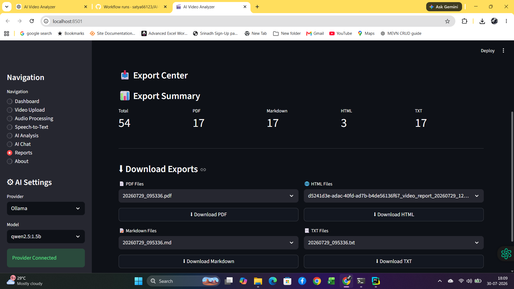

**Highlights**

- Export to TXT
- Export to Markdown
- Export to HTML
- Export to PDF

---

## ℹ️ About

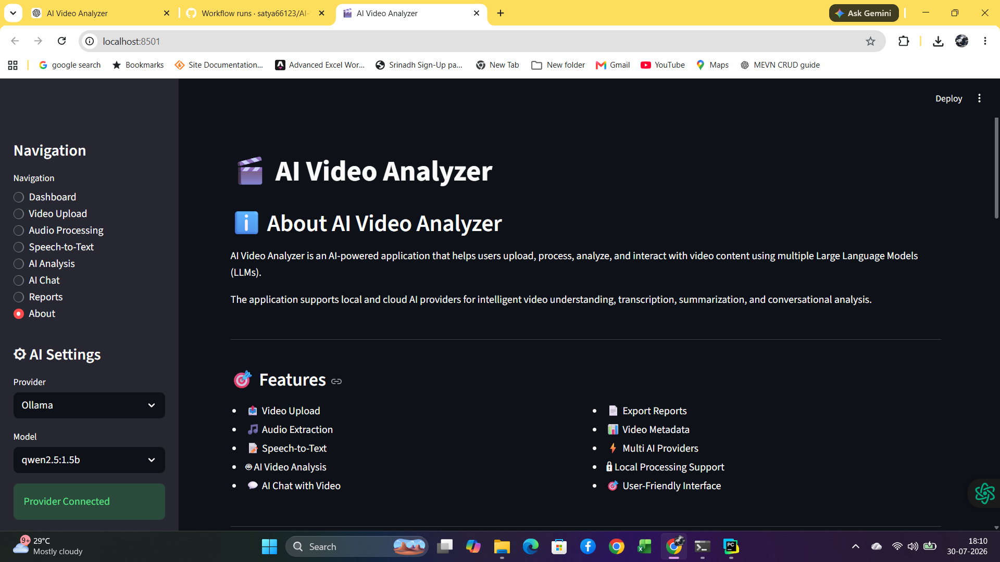

**Highlights**

- Project information
- Technologies used
- Version details

---

## ✅ All Tests Passed

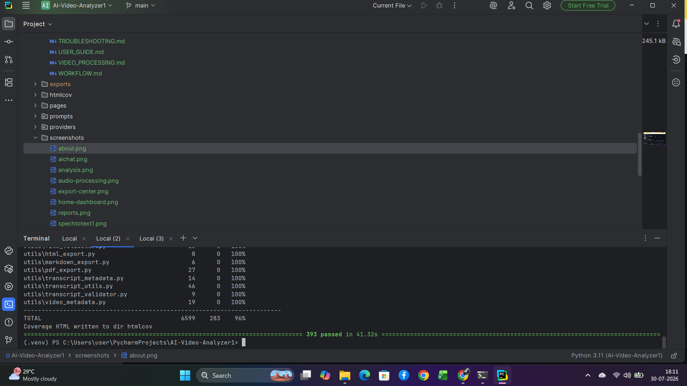

**Highlights**

- Pytest success
- CI-ready project
- Stable codebase

---

## 📷 Complete Screenshot Gallery

For detailed descriptions of every screenshot and the complete application walkthrough, see:

➡️ **[📸 SCREENSHOTS.md](docs/SCREENSHOTS.md)**

---

---

# 🧪 Testing

Run all tests:

```bash
pytest
```

Generate coverage:

```bash
pytest --cov
```

Continuous Integration is configured using GitHub Actions.

---

# 📚 Documentation

Comprehensive documentation is available inside the **docs/** folder.

- INSTALLATION.md
- FEATURES.md
- PROJECT_STRUCTURE.md
- ARCHITECTURE.md
- SYSTEM_DESIGN.md
- USER_GUIDE.md
- API_DOCUMENTATION.md
- PROVIDER_GUIDE.md
- VIDEO_PROCESSING.md
- AUDIO_PROCESSING.md
- AI_ANALYSIS.md
- EXPORT_GUIDE.md
- CONFIGURATION.md
- SECURITY.md
- FAQ.md
- TROUBLESHOOTING.md
- TESTING.md
- WORKFLOW.md
- CHANGELOG.md
- RELEASE_NOTES.md
- CONTRIBUTING.md
- CODE_OF_CONDUCT.md
- IMPLEMENTATION_STEPS.md
- PROJECT_PLANNER.md
- INTERVIEW_QUESTIONS.md
- INTERVIEW_ANSWERS.md
- RESUME_BULLETS.md
- DOCUMENTATION.md
- PROJECT_NOTES.md

---

# 📈 Skills Demonstrated

- Python
- Streamlit
- Whisper
- FFmpeg
- AI Integration
- REST APIs
- Software Architecture
- Factory Pattern
- SOLID Principles
- Dependency Injection
- Object-Oriented Programming
- Clean Code
- Unit Testing
- GitHub Actions
- CI/CD
- Technical Documentation

---

# 🔮 Future Enhancements

- User Authentication
- Database Integration
- Docker Support
- Cloud Deployment
- OCR Integration
- Speaker Diarization
- Batch Processing
- Real-Time Analysis
- Analytics Dashboard
- Kubernetes Deployment

---

# 🤝 Contributing

Contributions, suggestions, and improvements are welcome.

1. Fork the repository.
2. Create a feature branch.
3. Commit your changes.
4. Push to your branch.
5. Open a Pull Request.

---

# 📄 License

This project is licensed under the **MIT License**.

---

# 👨‍💻 Author

**Nekkanti Satya Srinath**

GitHub: https://github.com/satya66123

---

<div align="center">

## ⭐ If you found this project useful, please consider giving it a Star!

**Thank you for visiting the AI Video Analyzer repository!**

</div>